# 👁️⚙️ Olho na Máquina — Versão Modular (.py)

**Pipeline de Machine Learning para Manutenção Preditiva na Indústria 4.0**

Versão em módulos Python do projeto, refatorada a partir do notebook original.
Além do pipeline completo, inclui exploração com modelos avançados e uma
**interface web** para previsão de falhas com estimativa das causas prováveis.

---

## 📋 Sobre o projeto

**Olho na Máquina** é um pipeline completo de Ciência de Dados que prevê **falhas
mecânicas em equipamentos industriais** a partir de dados de sensores. O objetivo é
antecipar quebras antes que aconteçam, permitindo a manutenção preventiva e evitando
paradas não planejadas na linha de produção.

## 🎯 Problema que resolve

Em um parque fabril monitorado por sensores, paradas inesperadas de equipamentos geram
prejuízo e atrasos. O desafio é **prever se uma máquina vai falhar** (`1`) ou operar
normalmente (`0`) — um problema de **classificação binária**.

A principal dificuldade é que as falhas são **raras** (apenas ~3,4% dos registros), o que
exige tratamento estatístico cuidadoso para o modelo não se tornar tendencioso. O projeto
também evita a armadilha do **vazamento de dados (data leakage)**, removendo colunas que
revelam o motivo da falha.

## 🔄 Fluxo do pipeline

```mermaid
flowchart LR
    A[Base de Dados<br/>Sensores] --> B[1. EDA<br/>Análise Exploratória]
    B --> C[2. Limpeza<br/>Duplicados, Nulos, Outliers]
    C --> D[3. Feature Engineering<br/>Novas variáveis + Encoding]
    D --> E[4. Split 80/20<br/>+ SMOTE no treino]
    E --> F[5. Escalonamento<br/>StandardScaler - só KNN]
    F --> G[6. Ajuste de Parâmetros<br/>KNN e Árvore]
    G --> H[7. Avaliação<br/>Veredito Final]
    H --> I[Modelos Avançados<br/>RF, XGBoost, LightGBM]
    I --> J{{Interface Web<br/>Previsão + Causas}}
```



## 🧩 Arquitetura modular

O código foi separado por responsabilidade. Cada módulo cuida de uma etapa, e o
`main.py` chama as funções na ordem, passando os dados de um para o outro.

```
├── data/
│   └── manutencao_preditiva.csv   # base de dados
├── src/
│   ├── leitor.py            # Fase 1 - leitura da base e backup
│   ├── visao_df.py          # Fase 1 - análise exploratória (EDA)
│   ├── tratamento.py        # Fase 2 - duplicados, nulos e outliers
│   ├── engenharia_df.py     # Fase 3 - feature engineering e encoding
│   ├── modelos.py           # Fases 4, 5 e 6 - split, SMOTE, escalonamento, ajuste
│   ├── resultado.py         # Fase 7 - avaliação, veredito e gráficos
│   ├── modelos_avancados.py # Bônus - Random Forest, XGBoost e LightGBM
│   └── saidas.py            # Salva gráficos e resumo na pasta outputs/
├── main.py                  # orquestra todas as fases
├── salvar_modelo.py         # treina e salva o modelo para a interface
├── app.py                   # interface web (Streamlit)
├── modelo/                  # modelo treinado + estatísticas (gerado)
├── outputs/                 # gráficos e resumo (gerado ao rodar main.py)
├── requirements.txt
└── README.md
```

| Módulo | Fase(s) | Responsabilidade |
|---|---|---|
| `leitor.py` | 1 | Lê o CSV e retorna a base original (backup) + cópia de trabalho |
| `visao_df.py` | 1 | Dimensões, `describe`, histogramas, gráfico do alvo e heatmap |
| `tratamento.py` | 2 | Verifica duplicados, imputa nulos e plota boxplots |
| `engenharia_df.py` | 3 | Cria novas variáveis e faz o encoding da `tipo` |
| `modelos.py` | 4, 5, 6 | Separa X/y, split 80/20 + SMOTE, StandardScaler e ajuste |
| `resultado.py` | 7 | Acurácia final, veredito, comparação e importância das variáveis |
| `modelos_avancados.py` | Bônus | Random Forest, XGBoost, LightGBM + comparação dos 5 modelos |
| `saidas.py` | — | Salva os gráficos em `outputs/` e grava o resumo em texto |
| `main.py` | — | Executa todas as fases na ordem |
| `salvar_modelo.py` | — | Treina e salva o modelo/estatísticas para a interface |
| `app.py` | — | Interface web de previsão (Streamlit) |

## 🧠 Técnicas e tecnologias utilizadas

**Linguagem:** Python 3.14.3

**Bibliotecas (com versões):**

| Biblioteca | Versão | Uso |
|---|---|---|
| pandas | 3.0.3 | Manipulação e análise de dados |
| numpy | 2.5.1 | Operações numéricas |
| matplotlib | 3.11.0 | Visualização de dados |
| seaborn | 0.13.2 | Gráficos estatísticos |
| scikit-learn | 1.9.0 | Modelagem (KNN, Árvore, StandardScaler, métricas) |
| imbalanced-learn | 0.14.2 | Balanceamento com SMOTE |
| xgboost | 2.1.4 | Modelo avançado (gradient boosting) |
| lightgbm | 4.5.0 | Modelo avançado (gradient boosting) |
| streamlit | 1.40.0 | Interface web |
| joblib | 1.5.3 | Salvar/carregar o modelo treinado |

## 🏆 Resultados

**Modelos principais (obrigatórios):**

| Modelo | Configuração | Acurácia no Teste |
|---|---|---|
| KNN | K=3 | 0.921 |
| **Árvore de Decisão** | **max_depth=5** | **0.948** ✅ |

**Exploração adicional (modelos avançados):**

| Modelo | Acurácia no Teste |
|---|---|
| Random Forest | 0.973 |
| XGBoost | 0.975 |
| **LightGBM** | **0.977** 🏆 |

O modelo recomendado entre os obrigatórios é a **Árvore de Decisão (max_depth=5)**, pela
maior acurácia, estabilidade (sem overfitting), interpretabilidade e simplicidade
operacional. A análise de importância confirmou que a feature criada `potencia` foi a mais
relevante (34,82%), validando o feature engineering. Entre os modelos avançados, o
**LightGBM** obteve o melhor desempenho geral (0.977).

## 🖥️ Interface web (demonstração)

O projeto inclui uma interface web em **Streamlit** que prevê a falha de uma máquina a
partir dos dados dos sensores. Ao prever uma falha, o sistema também estima as **causas
prováveis para aquela máquina específica**, combinando a importância de cada variável no
modelo com o quão fora do normal está o valor informado.

**Como usar:**

```bash
python salvar_modelo.py     # treina e salva o modelo (rodar uma vez)
streamlit run app.py        # abre a interface no navegador
```

Na tela, informe os valores dos sensores e clique em **Prever**. O sistema mostra o
**risco de falha (%)**, o veredito (normal ou alerta) e, em caso de falha, o ranking das
**causas prováveis** (dissipação de calor, sobrecarga, potência ou desgaste).

## 📊 Saídas (outputs)

Ao rodar `python main.py`, os gráficos são **salvos automaticamente na pasta `outputs/`**
(sem abrir janelas), junto com um `resumo_resultados.txt`. Isso inclui os gráficos de EDA,
boxplots, comparação dos modelos, importância das variáveis e o comparativo dos 5 modelos.

## ▶️ Como executar

1. **Clone o repositório e entre na pasta:**
   ```bash
   git clone https://github.com/renatosadriano-debug/olho-na-maquina.git
   cd olho-na-maquina
   ```

2. **Crie e ative um ambiente virtual:**
   ```bash
   python -m venv .venv
   .venv\Scripts\activate      # Windows
   # source .venv/bin/activate  # Linux/Mac
   ```

3. **Instale as dependências:**
   ```bash
   pip install -r requirements.txt
   ```

4. **Execute o pipeline completo** (gera os gráficos em `outputs/`):
   ```bash
   python main.py
   ```

5. **Abra a interface web:**
   ```bash
   python salvar_modelo.py
   streamlit run app.py
   ```

## 🚀 Melhorias futuras

- **Otimização de hiperparâmetros** dos modelos avançados (Random Forest, XGBoost e
  LightGBM), já incluídos como exploração adicional.
- **Avaliar métricas além da acurácia** — como precisão, recall e F1-score, importantes
  em bases desbalanceadas.
- **Validação cruzada (cross-validation)** para uma estimativa mais robusta do desempenho.
- **Evoluir a estimativa de causas** treinando modelos dedicados por tipo de falha.

## 👤 Autor

Renato Adriano Turazi da Silva