# 👁️⚙️ Olho na Máquina — Versão Modular (.py)

**Pipeline de Machine Learning para Manutenção Preditiva na Indústria 4.0**

Versão em módulos Python do projeto, refatorada a partir do notebook original.
Mesma lógica e mesmos resultados, organizados por responsabilidade na pasta `src/`,
com um `main.py` orquestrando todas as fases.

---

## 📋 Sobre o projeto

**Olho na Máquina** é um pipeline completo de Ciência de Dados que prevê **falhas
mecânicas em equipamentos industriais** a partir de dados de sensores. O objetivo é
antecipar quebras antes que aconteçam, permitindo a manutenção preventiva e evitando
paradas não planejadas na linha de produção.

## 🎯 Problema que resolve

Em um parque fabril monitorado por sensores, paradas inesperadas de equipamentos geram
prejuízo e atrasos. O desafio é **prever se uma máquina vai falhar** (`1`) ou operar
normalmente (`0`) — um problema de **classificação binária**.

A principal dificuldade é que as falhas são **raras** (apenas ~3,4% dos registros), o que
exige tratamento estatístico cuidadoso para o modelo não se tornar tendencioso. O projeto
também evita a armadilha do **vazamento de dados (data leakage)**, removendo colunas que
revelam o motivo da falha.

## 🔄 Fluxo do pipeline

```mermaid
flowchart LR
    A[Base de Dados<br/>Sensores] --> B[1. EDA<br/>Análise Exploratória]
    B --> C[2. Limpeza<br/>Duplicados, Nulos, Outliers]
    C --> D[3. Feature Engineering<br/>Novas variáveis + Encoding]
    D --> E[4. Split 80/20<br/>+ SMOTE no treino]
    E --> F[5. Escalonamento<br/>StandardScaler - só KNN]
    F --> G[6. Ajuste de Parâmetros<br/>KNN e Árvore]
    G --> H[7. Avaliação<br/>Veredito Final]
    H --> I{{Árvore de Decisão<br/>Acurácia 0.948}}
```



## 🧩 Arquitetura modular

O código foi separado por responsabilidade. Cada módulo cuida de uma etapa do pipeline,
e o `main.py` chama as funções na ordem, passando os dados de um para o outro.

```
├── data/
│   └── manutencao_preditiva.csv   # base de dados (coloque aqui)
├── src/
│   ├── leitor.py            # Fase 1 - leitura da base e criação do backup
│   ├── visao_df.py          # Fase 1 - análise exploratória (EDA) e gráficos
│   ├── tratamento.py        # Fase 2 - duplicados, imputação de nulos e outliers
│   ├── engenharia_df.py     # Fase 3 - feature engineering e encoding da 'tipo'
│   ├── modelos.py           # Fases 4, 5 e 6 - split, SMOTE, escalonamento e ajuste
│   └── resultado.py         # Fase 7 - avaliação, veredito e gráficos finais
├── main.py                  # orquestra todas as fases (ponto de entrada)
├── requirements.txt         # dependências
└── README.md
```

| Módulo | Fase(s) | Responsabilidade |
|---|---|---|
| `leitor.py` | 1 | Lê o CSV e retorna a base original (backup) + cópia de trabalho |
| `visao_df.py` | 1 | Dimensões, `describe`, histogramas, gráfico do alvo e heatmap |
| `tratamento.py` | 2 | Verifica duplicados, imputa nulos (média/mediana) e plota boxplots |
| `engenharia_df.py` | 3 | Cria `potencia`, `diferenca_temperatura`, `esforco_mecanico` e faz o encoding da `tipo` |
| `modelos.py` | 4, 5, 6 | Separa X/y, split 80/20 + SMOTE, StandardScaler e ajuste de parâmetros |
| `resultado.py` | 7 | Acurácia final, veredito, gráfico comparativo e importância das variáveis |
| `modelos_avancados.py` | Bônus | Treina Random Forest, XGBoost e LightGBM (exploração adicional) |
| `main.py` | — | Executa todas as fases na ordem |

## 🧠 Técnicas e tecnologias utilizadas

**Linguagem:** Python 3.14.3

**Bibliotecas (com versões):**

| Biblioteca | Versão | Uso |
|---|---|---|
| pandas | 3.0.3 | Manipulação e análise de dados |
| numpy | 2.5.1 | Operações numéricas |
| matplotlib | 3.11.0 | Visualização de dados |
| seaborn | 0.13.2 | Gráficos estatísticos |
| scikit-learn | 1.9.0 | Modelagem (KNN, Árvore, StandardScaler, métricas) |
| imbalanced-learn | 0.14.2 | Balanceamento com SMOTE |
| xgboost | 2.1.4 | Modelo avançado (gradient boosting) |
| lightgbm | 4.5.0 | Modelo avançado (gradient boosting) |

**Modelos comparados:** K-Nearest Neighbors (KNN) e Árvore de Decisão.

## 🏆 Resultado

| Modelo | Configuração | Acurácia no Teste |
|---|---|---|
| KNN | K=3 | 0.921 |
| **Árvore de Decisão** | **max_depth=5** | **0.948** ✅ |

O modelo recomendado é a **Árvore de Decisão (max_depth=5)**, pela maior acurácia,
estabilidade (sem overfitting), interpretabilidade e simplicidade operacional. A análise
de importância das variáveis confirmou que a feature criada `potencia` foi a mais relevante
(34,82%), validando o feature engineering.

## ▶️ Como executar

1. **Clone o repositório e entre na pasta:**
   ```bash
   git clone <URL_DO_REPOSITORIO>
   cd <PASTA_DO_PROJETO>
   ```

2. **Crie e ative um ambiente virtual:**
   ```bash
   python -m venv .venv
   .venv\Scripts\activate      # Windows
   # source .venv/bin/activate  # Linux/Mac
   ```

3. **Instale as dependências:**
   ```bash
   pip install -r requirements.txt
   ```

4. **Coloque a base** `manutencao_preditiva.csv` na pasta `data/`.

5. **Execute o pipeline completo:**
   ```bash
   python main.py
   ```

> Os caminhos são relativos — não é necessário ajustar diretórios.

## 🚀 Melhorias futuras

- **Otimização de hiperparâmetros** dos modelos avançados (Random Forest, XGBoost e
  LightGBM), que já foram incluídos nesta versão como exploração adicional.
- **Avaliar métricas além da acurácia** — como precisão, recall e F1-score, importantes
  em bases desbalanceadas, onde a acurácia isolada pode enganar (um modelo que sempre
  prevê "não falha" já acertaria ~96,6%).
- **Evoluir para classificação multiclasse** — prever não só *se* a máquina vai falhar,
  mas *qual o motivo* (calor, sobrecarga ou potência).
- **Interface para a equipe de manutenção** — uma aplicação simples que receba os dados
  dos sensores e retorne o risco de falha.

## 👤 Autor

Renato Adriano Turazi da Silva